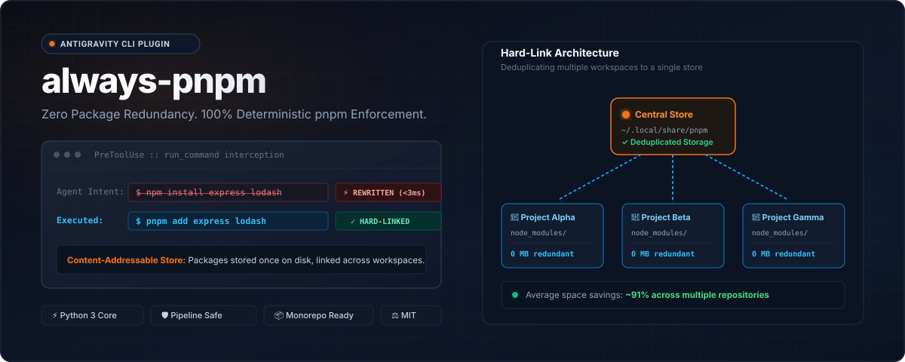
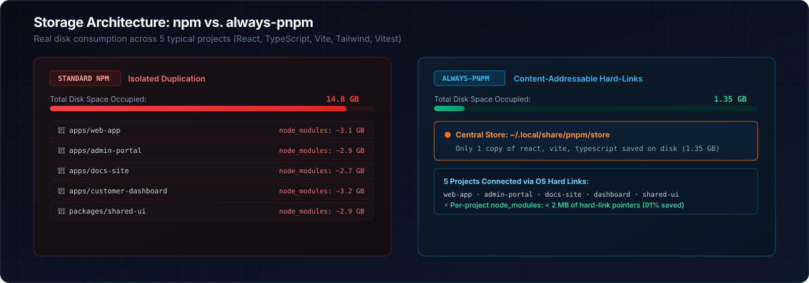

<p align="center">
  
</p>

<p align="center">
  <a href="https://github.com/youxufkhan/always-pnpm/blob/main/LICENSE"></a>
  <a href="https://pnpm.io"></a>
  
  
  
</p>

<p align="center">
  
</p>

In modern web development, running `npm install` across multiple projects duplicates hundreds of megabytes of identical dependencies in local `node_modules` folders, rapidly consuming tens of gigabytes of disk space.

`pnpm` solves this fundamentally by storing packages **once** in a global content-addressable store (`~/.local/share/pnpm/store`) and linking them into projects via filesystem hard links.

However, AI coding agents (**Antigravity**, **Claude Code**, **OpenCode**, and **Codex**) frequently default to `npm` or `npx` commands. **`always-pnpm`** intercepts commands at the tool lifecycle level, automatically rewriting or redirecting `npm` and `npx` invocations to `pnpm` with zero agent friction.

<p align="center">
  
</p>

---

<p align="center">
  
</p>

<p align="center">
  
</p>

`always-pnpm` operates on a two-layer defense strategy:

1. **Cognitive Alignment (`AGENTS.md` / `CLAUDE.md`)**: Instructs the model upfront to select `pnpm`, write `pnpm` documentation, and convert legacy `package-lock.json` files via `pnpm import`.
2. **Runtime Lifecycle Enforcement**: Intercepts terminal commands deterministically according to each agent's native lifecycle model:

| Agent | Enforcement Mechanism | Hook / Plugin Type | Behavior |
| :--- | :--- | :--- | :--- |
| **Antigravity** | `PreToolUse` hook on `run_command` | `hooks.json` | Transparent in-place command overwrite |
| **Claude Code** | `PreToolUse` hook on `Bash` | `settings.json` | Denies `npm` and instructs Claude with exact `pnpm` syntax |
| **OpenCode** | `tool.execute.before` plugin | `plugins/always-pnpm.js` | Transparent in-place command mutation |
| **Codex** | `PreToolUse` hook on `bash` | `hooks.json` | Blocks `npm` and instructs agent with exact `pnpm` syntax |

---

<p align="center">
  
</p>

### Option 1: Universal Auto-Detect Install (Recommended)
Automatically detects which agents are installed on your system and configures all of them:
```bash
curl -fsSL https://raw.githubusercontent.com/youxufkhan/always-pnpm/main/scripts/install.sh | bash
```

### Option 2: Target-Specific Installation
You can explicitly target one or more agents:
```bash
# Target specific agents
./scripts/install.sh --claude
./scripts/install.sh --opencode
./scripts/install.sh --codex
./scripts/install.sh --antigravity

# Configure all four targets regardless of detection
./scripts/install.sh --all
```

### Option 3: Clone & Symlink (For Developers / Live Updates)
Symlinks the repository so local changes apply immediately across your agent environments:
```bash
git clone https://github.com/youxufkhan/always-pnpm.git
cd always-pnpm
./scripts/install.sh --symlink
```

### Option 4: Repository-Specific Only (Local Workspace)
Enforces `always-pnpm` strictly inside the current project (`.claude/`, `.opencode/`, `.codex/`, `.agents/`):
```bash
./scripts/install.sh --local
```

---

<p align="center">
  
</p>

The zero-dependency Python engine translates all common `npm` and `npx` commands and flags:

| Input Command Pattern | Rewritten Output | Description |
| :--- | :--- | :--- |
| `npm install <pkgs>` / `npm i <pkgs>` | `pnpm add <pkgs>` | Add dependency |
| `npm i -D <pkgs>` / `--save-dev` | `pnpm add -D <pkgs>` | Add dev dependency |
| `npm i -E <pkgs>` / `--save-exact` | `pnpm add -E <pkgs>` | Add exact version |
| `npm i -O <pkgs>` / `--save-optional` | `pnpm add -O <pkgs>` | Add optional dependency |
| `npm i --save-peer <pkgs>` | `pnpm add --save-peer <pkgs>` | Add peer dependency |
| `npm i -g <pkgs>` / `--global` | `pnpm add -g <pkgs>` | Global package install |
| `npm install` / `npm i` (no args) | `pnpm install` | Install from lockfile |
| `npm ci` | `pnpm install --frozen-lockfile` | CI frozen lockfile install |
| `npm update` / `npm up` | `pnpm update` | Update dependencies |
| `npm uninstall <pkgs>` / `npm rm` | `pnpm remove <pkgs>` | Remove dependency |
| `npx <cmd>` / `npm exec <cmd>` | `pnpm dlx <cmd>` | Execute package binary |
| `npm run <script>` | `pnpm run <script>` | Execute npm script |
| `npm test` / `npm t` | `pnpm test` | Test script shortcut |
| `npm start` / `npm stop` | `pnpm start` / `pnpm stop` | Lifecycle shortcuts |
| `npm create <template>` | `pnpm create <template>` | Scaffolding |
| `npm init <template>` | `pnpm create <template>` | Initializer mapping |
| `npm init` / `npm init -y` | `pnpm init` | Package initialization |
| `npm ls` / `npm list` | `pnpm ls` | List installed packages |
| `npm why <pkg>` / `npm explain` | `pnpm why <pkg>` | Inspect dependency path |
| `npm outdated` | `pnpm outdated` | Check outdated packages |
| `npm audit` / `npm audit fix` | `pnpm audit` | Security audit |
| `npm cache clean --force` | `pnpm store prune` | Reclaim global disk space |
| `npm link` / `npm unlink` | `pnpm link` / `pnpm unlink` | Link local packages |
| `npm pack` / `npm publish` | `pnpm pack` / `pnpm publish` | Packaging & publishing |
| `npm rebuild` | `pnpm rebuild` | Rebuild native modules |

#### False-Positive Protection
Commands where `npm` appears only as an argument or in string literals remain untouched:
- `git commit -m "fix: npm build error"` $\rightarrow$ *unchanged*
- `echo "install with npm"` $\rightarrow$ *unchanged*
- `grep -r "npm" ./docs` $\rightarrow$ *unchanged*

---

## Testing & Verification

Run the comprehensive unit test suite and installer verification:

```bash
# Run unit & multi-agent integration tests
python3 -m unittest discover tests

# Run multi-agent installer test suite
bash tests/test_installer.sh
```

---

<p align="center">
  <a href="https://github.com/oil-oil/beautify-github-readme">
    
  </a>
</p>

## License

MIT © [Yousuf Khan](https://github.com/youxufkhan)
